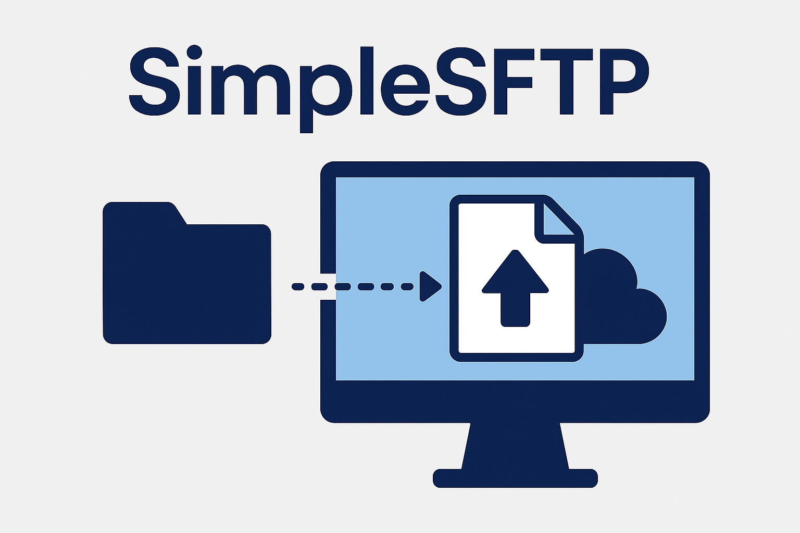

# SimpleSFTP

> A lightweight, customizable, and secure SFTP server built with Docker and OpenSSH.



**SimpleSFTP** provides an easy way to deploy a secure and flexible SFTP server using Docker.
It supports dynamic user creation via environment variables or config files, with options for password authentication, SSH keys, custom UID/GID, and volume mounting.

### Features

- Easy setup with Docker
- User management through environment variables or configuration files
- Support for SSH keys
- Customizable host keys
- Lightweight and efficient

## Quick Start

To run a simple SFTP server using Docker:

```
docker run -p 22:22 -d simplesftp foo:pass:::upload
```

## User Configuration

Define users using the `SFTP_USERS` environment variable or in a configuration file. The format is:

```
user:pass[:e][:uid[:gid[:dir1[,dir2]...]]]
```

## Examples

### Upload User

To create a user that can upload files:

```
docker run -v <host-dir>/upload:/home/foo/upload -p 2222:22 -d simplesftp foo:pass
```

### Multiple Users

You can define multiple users in the `SFTP_USERS` variable:

```
docker run -e SFTP_USERS="foo:pass:1001,bar:pass:1002" -p 2222:22 -d simplesftp
```

### SSH Keys

To allow login using SSH keys, mount the public key:

```
docker run -v <host-dir>/id_rsa.pub:/home/foo/.ssh/keys/id_rsa.pub:ro -p 2222:22 -d simplesftp foo::
```

### Custom Host Keys

To use your own SSH host keys:

```
docker run -v <host-dir>/ssh_host_ed25519_key:/etc/ssh/ssh_host_ed25519_key -p 2222:22 -d simplesftp foo::
```

## Volumes and Permissions

Ensure proper permissions on mounted volumes to allow users to write files. Use UID/GID settings as needed.

## Advanced Startup Customization

You can place scripts in `/etc/sftp.d/` to customize startup behavior.

## Why SimpleSFTP?

SimpleSFTP offers a modernized approach to SFTP server management, focusing on simplicity, flexibility, and performance.

## License

MIT License

## Acknowledgment

This project is a fork based on atmoz/sftp.
